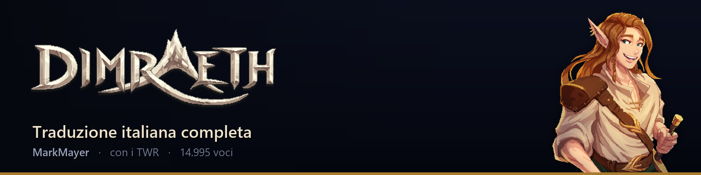

<p align="center">
  
</p>

<p align="center">
  <a href="../../releases/latest"></a>
  <a href="../../releases"></a>
  
  <a href="LICENSE"></a>
</p>

<p align="center">
  <a href="https://github.com/markmayer00/dimraeth-patch-italiana/releases/latest/download/PatchItaliana_Dimraeth.zip"></a>
  &nbsp;
  <a href="../../issues/new/choose"></a>
  &nbsp;
  <a href="https://discord.gg/85ayAcHRfH"></a>
  &nbsp;
  <a href="CHANGELOG.md"></a>
</p>

<p align="center">
  <sub>Windows · 25 MB · sempre l'ultima versione</sub><br>
  <sub>
    <a href="https://github.com/markmayer00/dimraeth-patch-italiana/releases/latest/download/PatchItaliana_Dimraeth_cartella.zip">versione cartella</a>, se l'antivirus blocca ·
    <a href="docs/come-funziona.md">come funziona</a> ·
    <a href="../../releases">tutte le versioni</a> ·
    <a href="CHANGELOG.md">cosa è cambiato</a>
  </sub>
</p>

# Patch Italiana — Dimraeth

Traduce in italiano **tutto** il testo di Dimraeth e aggiunge una voce
**Italiano** nel menu delle lingue.

Interfaccia, missioni, dialoghi di tutti e diciassette i personaggi, codice,
albero delle abilità, incantesimi, oggetti, bacheca degli incarichi, messaggi
d'errore, la cinematica d'apertura. Niente è lasciato a metà.

**Copertura: 100%** — 14.995 voci di testo, 176.226 parole.

> **Traduzione e patch: MarkMayer**, pubblicate insieme ai
> **[TWR](https://discord.gg/85ayAcHRfH)**, il gruppo di traduzione italiano
> con cui collaboro.
> Prima di questa patch Dimraeth in italiano non c'era: non è il riadattamento
> di un lavoro esistente, è tradotto da zero.
> Lavoro di appassionati, non autorizzato né commissionato da Mudtek.
> Dettagli in [CREDITI.txt](CREDITI.txt).

---

## Come si usa

**Prima di estrarre:** clic destro sullo zip scaricato → Proprietà → spunta
**"Annulla blocco"** in basso → OK. Windows marca tutto quello che arriva da
internet e il marchio passa ai file estratti; togliendolo prima, l'avviso di
SmartScreen di solito non compare.

1. Chiudi il gioco, se è aperto
2. Doppio clic su `PatchItaliana_Dimraeth.exe`
3. Il programma cerca Dimraeth da solo; se non lo trova, premi **Sfoglia...**
4. Scegli quale lingua cedere all'italiano — di norma va bene il portoghese
5. Premi **APPLICA LA TRADUZIONE** e aspetta un minuto
6. Nel gioco: Impostazioni → Lingua → **Italiano**

Per tornare indietro c'è il pulsante **Ripristina**. Il backup viene creato da
solo alla prima esecuzione, e viene rifatto quando il gioco si aggiorna — così
riapplicare la patch non riporta mai indietro una versione vecchia.

> **Steam:** la *verifica integrità dei file* rimette gli originali, e la patch
> va riapplicata. Succede anche dopo ogni aggiornamento del gioco.

## Perché devo cedere una lingua

Il menu delle lingue di Dimraeth ne mostra otto, ed è **compilato** per mostrare
quelle: non c'è modo di aggiungerne una nona senza riscrivere il programma del
gioco. Quello che si può fare è riempire di italiano una delle otto e
rinominare la sua voce di menu in "Italiano". Le altre restano intatte.

Di serie viene ceduto il **portoghese**; dal menu a tendina se ne può scegliere
un'altra. L'**inglese non si può cedere**, apposta: è quello che il gioco mostra
se una riga non fosse tradotta, e senza diventerebbe illeggibile.

## Cosa tocca, esattamente

Due file dentro la cartella del gioco.

| file | cosa cambia |
|---|---|
| `Dimraeth_Data\sharedassets1.assets` | i testi: 16 tabelle CSV, una per categoria |
| `Dimraeth_Data\il2cpp_data\Metadata\global-metadata.dat` | **nove byte**: il nome della lingua nel menu, da *Português* a *Italiano* |

Accanto a ciascuno restano un `.orig`, che è la copia di sicurezza, e un
`.patchinfo`, che serve al programma per accorgersi se il gioco è stato
aggiornato. Senza il `.orig` il pulsante **Ripristina** non ha più niente da
cui ripartire.

Il programma **non scrive niente se un controllo fallisce**: o la patch riesce
per intero, o il gioco resta com'era.

## "Windows ha protetto il PC"

È SmartScreen, e non vuol dire che sia stato trovato un virus: avvisa per
qualsiasi programma che non abbia ancora una reputazione, cioè tutti quelli non
firmati con un certificato di code signing a pagamento. Premi **Ulteriori
informazioni → Esegui comunque**.

Se preferisci non fidarti di un eseguibile, il codice è tutto qui e puoi
ricompilarlo da solo in due minuti: vedi *Compilare dai sorgenti*.

## Problemi e segnalazioni

Se qualcosa non funziona, **[apri una segnalazione](../../issues/new/choose)**:
c'è un modulo che chiede le poche cose che servono per capire il problema.

Vanno benissimo anche le segnalazioni sulla **traduzione in sé** — un termine
che non convince, una frase che suona male, una scritta che esce dal riquadro.
Le scritte tagliate in particolare si vedono solo a schermo: se ne trovi una,
uno screenshot vale più di dieci righe di descrizione.

Per parlarne a voce, o solo per fare due chiacchiere sulla traduzione, c'è il
**[Discord dei TWR](https://discord.gg/85ayAcHRfH)**.

---

## Come funziona

I testi stanno in `sharedassets1.assets`, in 16 tabelle `Key,Text` — una per
categoria — ripetute per ognuna delle dieci corsie di lingua. La patch riempie
di italiano la corsia scelta, partendo **sempre dall'inglese**: quello che non
fosse tradotto resta inglese, mai vuoto e mai nella lingua ceduta.

Si traduce **per testo, non per riga**: la stessa frase compare sotto chiavi
diverse a seconda della schermata, e 24.887 righe si coprono con 14.995 voci.

Le corsie di lingua vengono riconosciute **dal contenuto**, non dalla posizione
nel file: gli identificativi interni cambiano a ogni build del gioco, e fidarsi
di quelli vorrebbe dire una patch che si rompe al primo aggiornamento.

Spiegazione estesa: **[docs/come-funziona.md](docs/come-funziona.md)**

## Compilare dai sorgenti

Serve Python 3.10 o più recente.

```bash
python -m venv .venvbuild
.venvbuild\Scripts\pip install UnityPy pillow pyinstaller

REM le prove, che si possono lanciare da sole
.venvbuild\Scripts\python src\prova_motore.py
.venvbuild\Scripts\python src\prova_finestra.py
.venvbuild\Scripts\python src\prova_ricerca.py

REM l'eseguibile
.venvbuild\Scripts\pyinstaller --onefile --windowed ^
  --name PatchItaliana_Dimraeth ^
  --add-data "src\italiano.json.gz;." --add-data "src\banner.png;." ^
  --hidden-import motore --hidden-import chiptune --hidden-import winsound ^
  --collect-all UnityPy src\dimraeth_patch_gui.py

REM e poi la prova che conta: l'eseguibile, mentre applica
.venvbuild\Scripts\python src\prova_exe.py
```

Compila **sempre da un ambiente virtuale pulito**: da un Python con molti
pacchetti installati, PyInstaller trascina dentro di tutto e l'eseguibile passa
da 25 MB a qualche centinaio.

Serve `--collect-all UnityPy`, non `--collect-submodules`: UnityPy porta con sé
un file di **dati** (`resources/lzma.tpk`, il database dei type tree) che
`--collect-submodules` non raccoglie. Senza, l'eseguibile si apre benissimo e
poi fallisce al momento di applicare, perché su una build IL2CPP — che i type
tree non li contiene — non riesce a interpretare nessun oggetto.

### La modalità senza finestra

L'eseguibile, se gli si passano argomenti, fa il lavoro e se ne va. Serve per
provarlo davvero, ed è comoda per chi preferisce la riga di comando:

```bash
PatchItaliana_Dimraeth.exe "C:\...\Dimraeth_Data" --lingua pt
PatchItaliana_Dimraeth.exe "C:\...\Dimraeth_Data" --ripristina
PatchItaliana_Dimraeth.exe "C:\...\Dimraeth_Data" --log esito.txt
```

Senza console attaccata `print` non si vede: per questo c'è `--log`.

## Contenuto

| percorso | cosa fa |
|---|---|
| `src/motore.py` | tutto quello che tocca i file del gioco |
| `src/dimraeth_patch_gui.py` | solo l'interfaccia |
| `src/chiptune.py` | la musichetta, sintetizzata a ogni avvio |
| `src/italiano.json.gz` | le 14.995 voci italiane |
| `src/banner.png` | l'immagine dell'intestazione |
| `src/prova_motore.py` | 12 controlli sul motore, 5 guardie rotte apposta |
| `src/prova_finestra.py` | 15 controlli sulla finestra, con `mainloop` vero |
| `src/prova_ricerca.py` | 6 controlli sulla ricerca dell'installazione |
| `src/prova_exe.py` | 11 controlli sull'**eseguibile compilato**, mentre applica |
| `src/estrai_grafica.py` | tira fuori dal gioco le due immagini del banner |
| `src/make_banner.py` · `src/make_bottone.py` | rigenerano le immagini |
| `docs/come-funziona.md` | com'è fatta la patch, per esteso |

Le prove vogliono sapere dove sta il gioco. Se non lo passi, se lo cercano da
sole:

```bash
python src\prova_motore.py "C:\...\Dimraeth_Data"
set DIMRAETH_DATA=C:\...\Dimraeth_Data
```

**Il motore sta separato dalla finestra apposta.** Una GUI si prova male: i
pulsanti vanno premuti a mano e gli errori finiscono in una casella di testo che
nessuno rilegge. Separandolo, 33 controlli girano da soli.

---

## Licenza

Il **codice** di questo repository è rilasciato sotto licenza MIT — vedi
[LICENSE](LICENSE).

La **traduzione italiana** (`src/italiano.json.gz`) è di MarkMayer, pubblicata
con i TWR, e non è coperta dalla licenza del codice.

Dimraeth è di **Mudtek**. Tutti i diritti sul gioco, sui suoi testi originali,
sui suoi personaggi e sulle sue immagini sono loro. Questa è una patch
amatoriale non ufficiale, senza alcun legame con loro, e non ci si guadagna
niente.
